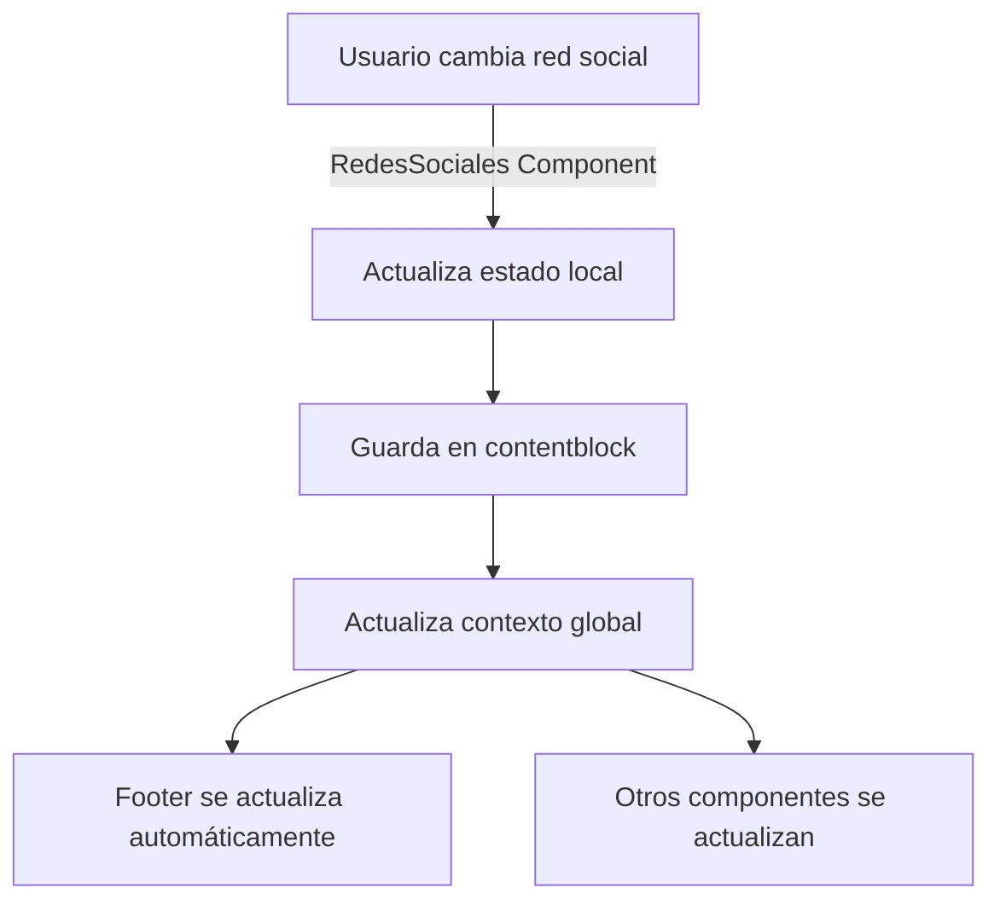

# Sincronización de Redes Sociales

Este documento explica cómo funciona la sincronización automática de redes sociales entre el componente `RedesSociales` y la vista previa del footer.

## Problema Resuelto

Anteriormente, las redes sociales y la configuración del footer vivían en **contentblocks independientes**, lo que causaba que:

- Cuando se activaba/desactivaba una red social, no se veía reflejado inmediatamente en la vista previa del footer
- Era necesario recargar la página para ver los cambios sincronizados
- Los datos se duplicaban entre diferentes componentes

## Solución Implementada

### 1. Contexto Global de Redes Sociales

Se creó `SocialNetworksContext` que:

- **Centraliza el estado** de las redes sociales en toda la aplicación
- **Maneja la carga** automática desde el contentblock `REDESSOCIALES`
- **Proporciona funciones** para actualizar y guardar redes sociales
- **Notifica cambios** a todos los componentes que lo usan

```typescript
// context/SocialNetworksContext.tsx
interface SocialNetworksContextType {
  socialNetworks: SocialNetwork[];
  loading: boolean;
  error: string | null;
  updateSocialNetworks: (networks: SocialNetwork[]) => void;
  refreshSocialNetworks: () => Promise<void>;
  saveSocialNetworks: (networks: SocialNetwork[]) => Promise<boolean>;
}
```

### 2. Componentes Sincronizados

#### RedesSociales Component

- **Usa el contexto** para obtener y actualizar redes sociales
- **Guarda cambios** automáticamente en el contentblock
- **Notifica al contexto** cuando hay cambios para actualizar otros componentes

#### Footer01BO Component

- **Lee redes sociales** directamente del contexto
- **Se actualiza automáticamente** cuando cambian las redes sociales
- **Muestra vista previa** sincronizada en tiempo real

### 3. Flujo de Sincronización



## Arquitectura

### Estructura de Datos

```typescript
interface SocialNetwork {
  name: string; // Nombre de la red social
  url: string; // URL del perfil
  enabled: boolean; // Si está habilitada o no
}
```

### ContentBlocks

1. **`REDESSOCIALES`**: Almacena la configuración de redes sociales
2. **`footer-config-default`**: Almacena la configuración del footer (sin redes sociales)

### Contexto Provider

El `SocialNetworksProvider` debe envolver los componentes que necesiten acceso a las redes sociales:

```typescript
// app/dashboard/layout.tsx
<SocialNetworksProvider>
  {/* Componentes del dashboard */}
</SocialNetworksProvider>
```

## Uso en Componentes

### Hook useSocialNetworks

```typescript
import { useSocialNetworks } from "@/context/SocialNetworksContext";

const MyComponent = () => {
  const {
    socialNetworks, // Array de redes sociales
    loading, // Estado de carga
    updateSocialNetworks, // Función para actualizar
    saveSocialNetworks, // Función para guardar
  } = useSocialNetworks();

  // Usar las redes sociales...
};
```

### Componentes que usan el contexto

1. **RedesSociales**: Para gestionar la configuración
2. **Footer01BO**: Para mostrar vista previa
3. **FooterPreview**: Para renderizar la vista previa
4. **DynamicFooter**: Para mostrar en el frontend

## Beneficios

### ✅ Sincronización Automática

- Los cambios se reflejan inmediatamente en todos los componentes
- No es necesario recargar la página

### ✅ Fuente Única de Verdad

- Todas las redes sociales se gestionan desde un solo lugar
- Elimina duplicación de datos

### ✅ Rendimiento Mejorado

- Carga una sola vez desde la API
- Comparte el estado entre componentes

### ✅ Escalabilidad

- Fácil agregar nuevos componentes que usen redes sociales
- Mantiene la consistencia automáticamente

## Mantenimiento

### Agregar Nueva Red Social

1. Actualizar el array `allAvailableNetworks` en `RedesSociales.tsx`
2. Agregar el icono correspondiente en la función `getSocialNetworkIcon`
3. El resto se maneja automáticamente

### Depuración

Si las redes sociales no se sincronizan:

1. **Verificar el Provider**: Asegúrate de que `SocialNetworksProvider` envuelve los componentes
2. **Revisar la consola**: Buscar errores de carga del contentblock
3. **Verificar variables de entorno**: Confirmar `NEXT_PUBLIC_REDESSOCIALES_CONTENTBLOCK`

### Variables de Entorno

```env
NEXT_PUBLIC_REDESSOCIALES_CONTENTBLOCK=REDESSOCIALES
NEXT_PUBLIC_API_URL_CLIENTE=https://api.cliente.com
NEXT_PUBLIC_API_URL_BO_CLIENTE=https://api.bo.cliente.com
NEXT_PUBLIC_API_URL_SITEID=your-site-id
```

## Compatibilidad

Esta implementación es compatible con:

- ✅ Planes básicos y avanzados
- ✅ Frontend y dashboard
- ✅ Todos los templates de footer existentes
- ✅ Configuración existente de contentblocks

Los datos se migran automáticamente sin necesidad de intervención manual.
